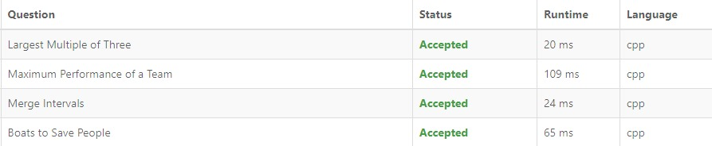

# Exercícios LeetCode

**Conteúdo da Disciplina**: Greed 

# NomedoProjeto

## Alunos
|Matrícula | Aluno |
| -- | -- |
| 19/0087439 | Gabriel de Souza Fonseca Ribeiro |

## Sobre 
Este repositório contem a solução de alguns exercícios do site [LeetCode](www.leetcode.com):

- [56. Merge Intervals ](https://leetcode.com/problems/merge-intervals/)
- [1383. Maximum Performance of a Team ](https://leetcode.com/problems/maximum-performance-of-a-team/description/)
- [1363. Largest Multiple of Three](https://leetcode.com/problems/largest-multiple-of-three/)
- [881. Boats to Save People](https://leetcode.com/problems/boats-to-save-people/)

## Screenshots

## Utilização
Basta acessar o link de cada problema e submeter o código, é necessário criar uma conta no LeetCode para rodar o código.

## Explicação
### [56. Merge Intervals ](https://leetcode.com/problems/merge-intervals/)

https://www.youtube.com/watch?v=zi-X_o1lnno

### [1383. Maximum Performance of a Team ](https://leetcode.com/problems/maximum-performance-of-a-team/description/)
https://youtu.be/V2-B5JyiR1c

### [1363. Largest Multiple of Three](https://leetcode.com/problems/largest-multiple-of-three/)

https://youtu.be/5f2F1qS_iTg

### [881. Boats to Save People](https://leetcode.com/problems/boats-to-save-people/)
https://youtu.be/sSIMMqkGil4